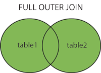

# JOIN

## JOIN

The INNER JOIN keyword selects records that have matching values in both tables.

```m
SELECT column1, column2 FROM table1
INNER JOIN table2 
ON table1.column_name = table2.column_name;
```


## LEFT JOIN

The LEFT JOIN keyword returns all records from the left table (table1), and the matched records from the right table (table2). The result is NULL from the right side, if there is no match.

```m
SELECT column1, column2 FROM table1
LEFT JOIN table2
ON table1.column_name = table2.column_name;
```


## RIGHT JOIN

The RIGHT JOIN keyword returns all records from the right table (table2), and the matched records from the left table (table1). The result is NULL from the left side, when there is no match.

```m
SELECT column1, column2 FROM table1
RIGHT JOIN table2
ON table1.column_name = table2.column_name;
```


## FULL JOIN

The FULL JOIN keyword returns all records when there is a match in left (table1) or right (table2) table records.

```m
SELECT column1, column2 FROM table1
FULL JOIN table2
ON table1.column_name = table2.column_name
WHERE condition;
```


